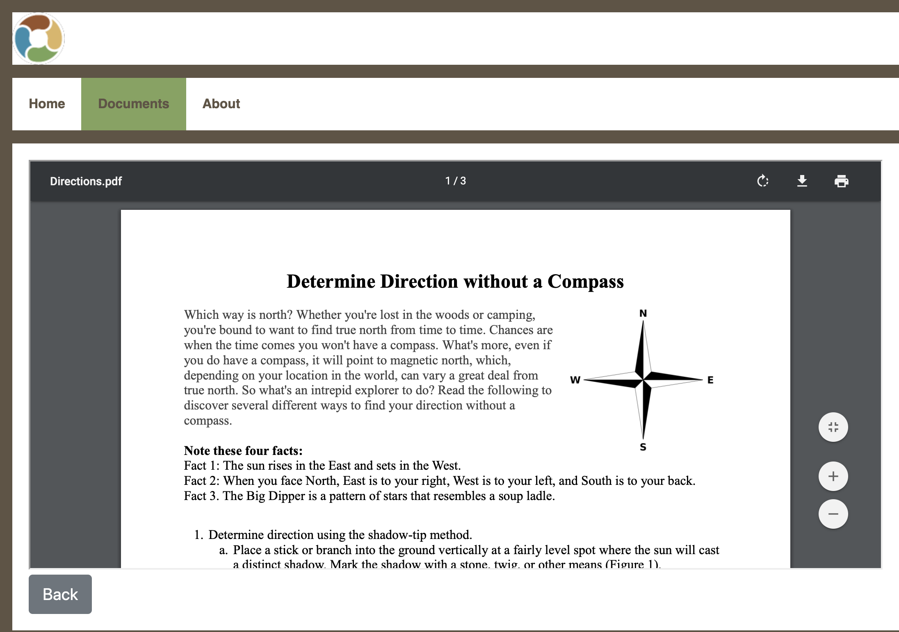
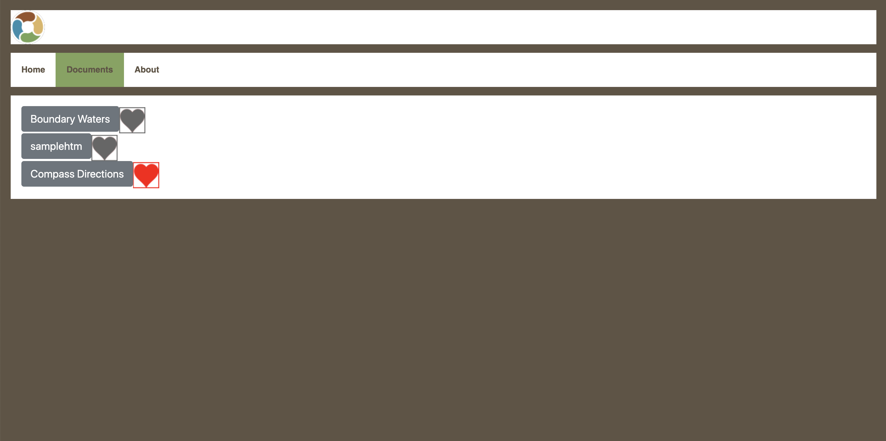

# Terraso Library

The Terraso Library is a Progressive Web App that allows the user to view documents (images, PDFs, text files, etc.) and store them for offline reading. This was created as part of the [1000 Landscapes Project](https://techmatters.org/project/1000-landscapes/) primarily to research the functionality and limitations of Progressive Web Apps. This relies on Amazon Web Services: AppSync, DynamoDB, and Amazon S3.

## Using the Terraso Library
The homepage contains an overview viewer:
<br>

You can change languages using a dropdown menu. English, French and Spanish are available.
<br>

The Documents page contains a list of Documents (fetched from a GraphQL API)
<br>

You can click (or tap, if on mobile) on buttons to open a Document.
<br>

Clicking (or tapping) the heart button next to each Document will favorite that document, adding it to the Cache and making that document available offline.
<br>

## For developers

### Prerequisites
Before using the Terraso Library, install git, node and npm. You will also need an Amazon Web Services (AWS) account to configure it like we have. It should work without AWS, but we don't have instructions for that.

### Installation
```
git clone https://github.com/techmatters/terraso-library-prototype
cd terraso-library-prototype
npm install
npm run start
```

### Setting up an AWS Resources
* [Set up an S3 bucket to host documents](https://github.com/techmatters/terraso-library-prototype/blob/master/S3config.md)

* [Setting up an AppSync GraphQL server](https://github.com/techmatters/terraso-library-prototype/blob/master/GraphQL.md)
