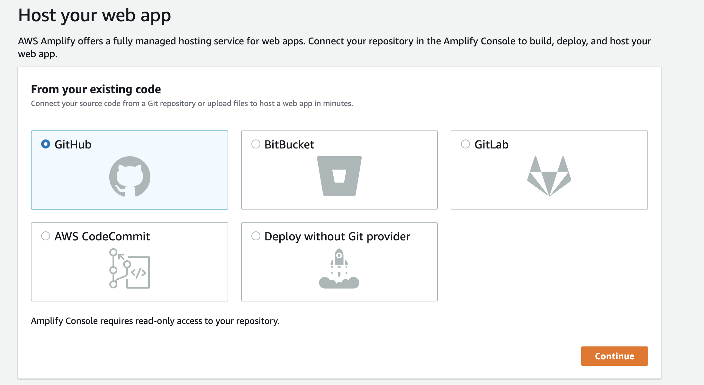
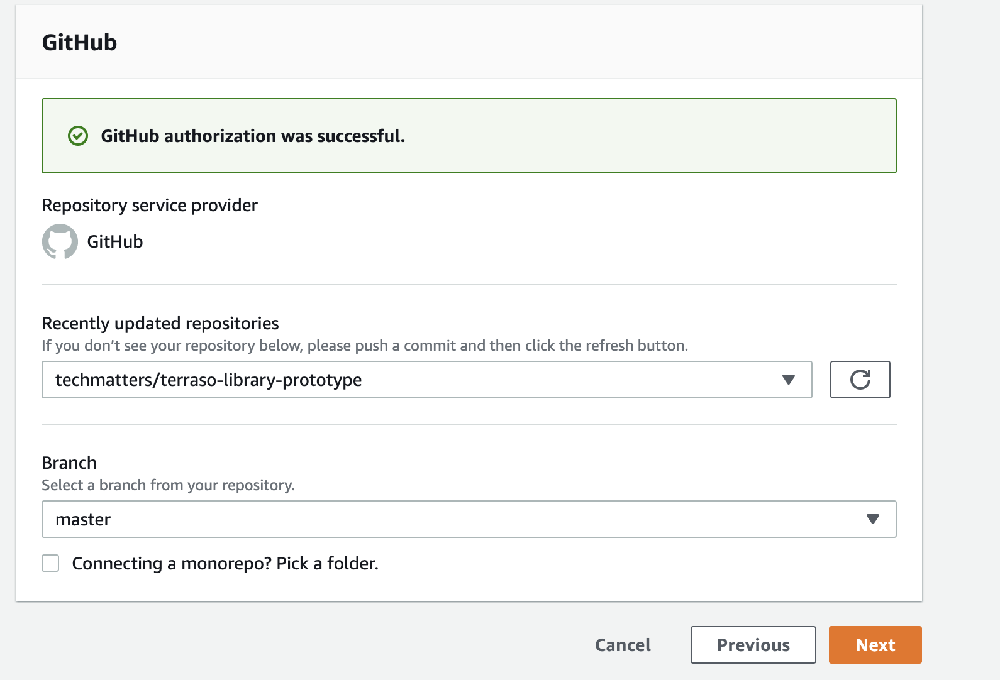
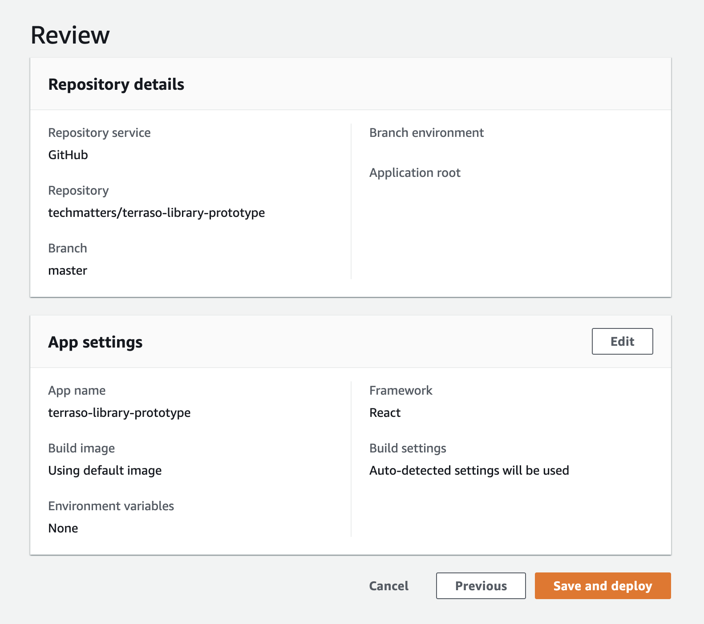
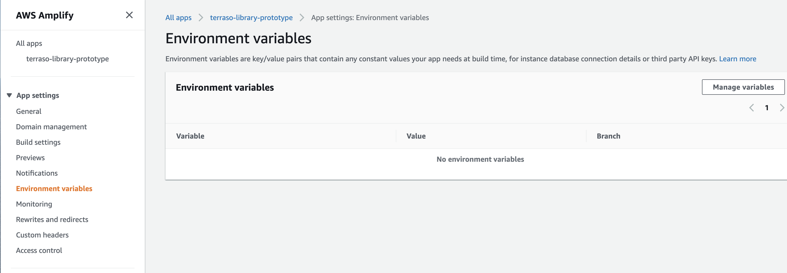
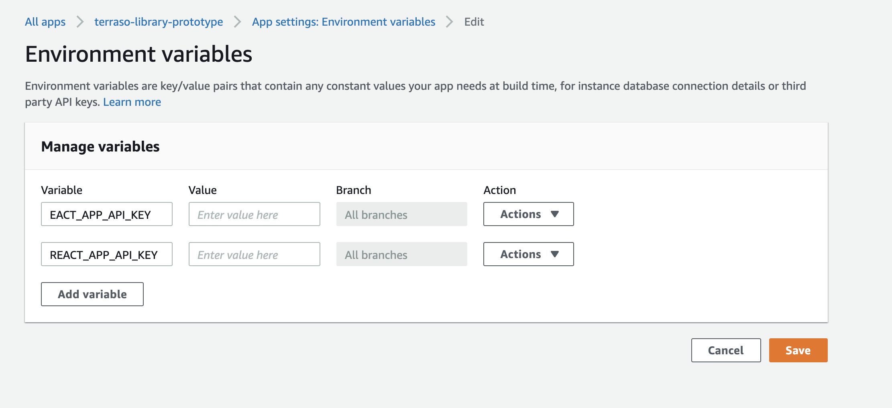

# Hosting the Terraso Library from GitHub with Amplify

## Connecting the GitHub repository
* Navigate to https://us-west-1.console.aws.amazon.com/amplify/home?region=us-west-1#/home and click "Get Started" button under Deliver
* Select GitHub and click the Continue button
 
* You may be required to Authenticate with GitHub, if so follow the instructions on your screen to Authenticate.
* Once GitHub authorization is successful choose the repository and branch and click next
 
* on "App and Build Settings" click next
* Review the details of your application and then click "Save and Deploy"
*  

## Adding Environment Variables
* in App Settings, click environment variables
 
* click the "Manage Variables" box
* Add variables for REACT_APP_API_KEY and REACT_APP_API_KEY
 
