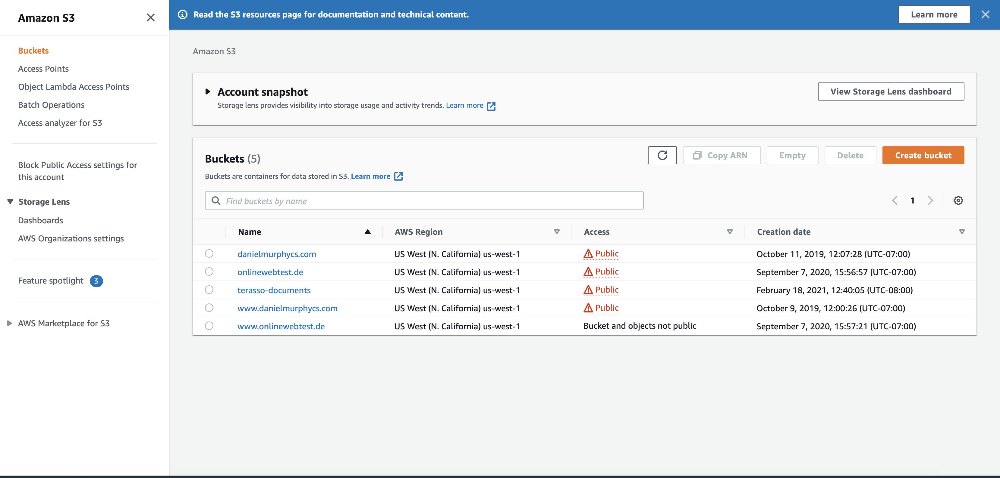
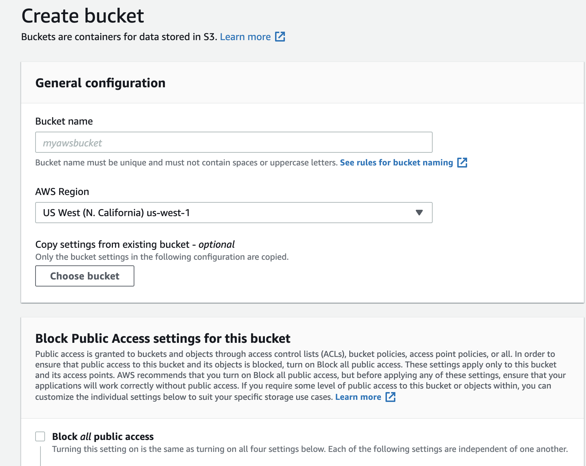
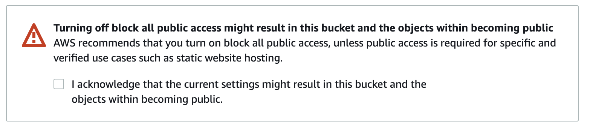
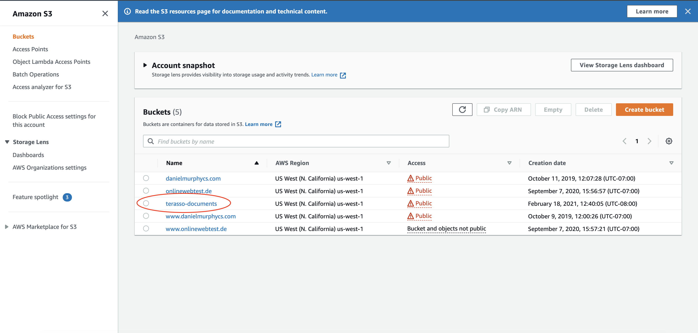

# Creating and Configuring an S3 Bucket

## Creating an S3 Bucket

* In [the S3 console](https://s3.console.aws.amazon.com/s3/), click "Create bucket":
<br>

* Give your bucket a name (such as "terraso-documents")
<br>

* **Uncheck** the box "block all public access." Making your bucket public will require you to acknowledge the following statement:
<br>

* Check "I acknowledge that the current settings might result in this bucket and the objects within becoming public."

* Scroll to the bottom of the page and click "Create bucket"


## Make the document accessible

* Navigate back to the S3 Console and click on your S3 bucket
<br>

* Click the Permissions tab

### Bucket policy
* Scroll to "Bucket policy"
* Click Edit
* Paste in this JSON, which enables public access to all documents in the bucket:
```json
{
    "Version": "2008-10-17",
    "Statement": [
        {
            "Sid": "AllowPublicRead",
            "Effect": "Allow",
            "Principal": {
                "AWS": "*"
            },
            "Action": "s3:GetObject",
            "Resource": "arn:aws:s3:::terraso-documents/*"
        }
    ]
}
```

Replace `terrasso-documents` with your bucket name.

* Click Save changes

### CORS

In order to retrieve documents for caching, you have to enable CORS (Cross-origin resource sharing).

* Scroll to the bottom of the page to "Cross-origin resource sharing (CORS)"
* Click Edit
* Paste in this JSON, which enables access to all documents in the bucket for the two servers we specify:
```json
[
    {
        "AllowedHeaders": [
            "*"
        ],
        "AllowedMethods": [
            "PUT",
            "POST",
            "DELETE",
            "GET"
        ],
        "AllowedOrigins": [
            "https://example.com",
            "https://localhost:3000"
        ],
        "ExposeHeaders": []
    }
]
```

Replace `localhost:3000` and `example.com` with your actual server URLs.

* Click Save changes

## Uploading and accessing documents

* Go to your S3 bucket
* Select the Objects tab
* Click Upload
* Click Add files
* Select one or more files on your computer
* Click Upload

<br>

* Click on the name of a document you uploaded (example: Directions.pdf)

In the window that appears, you will see the public S3 URL ("Object URL"), such as:
```
https://terraso-documents.s3.amazonaws.com/Directions.pdf
```

Click on the object URL and confirm you can view the document.

<br>
